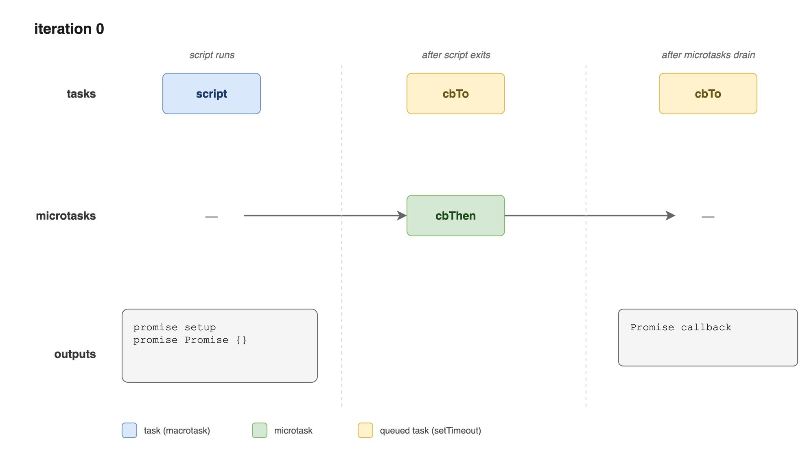
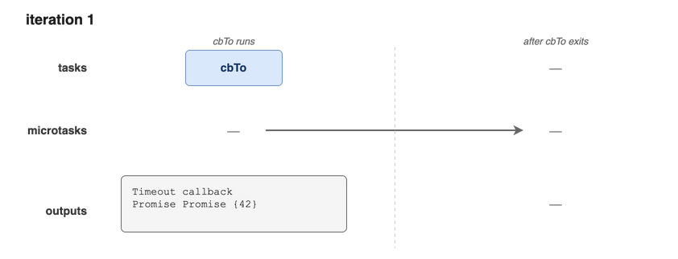

# Javascript & Typescript Study Sets

---

## Why WeakMap?

---

```javascript
const _countMap = new WeakMap();
class Counter {
  constructor() { _countMap.set(this, 0); }

  count() { return _countMap.get(this); }

  increment() {
    const currentCount = _countMap.get(this);
    _countMap.set(this, currentCount + 1);
  }
}
```

When an instance of `Counter` is GCed, its count in `_countMap` will be freed. In contrast, if `_countMap` is a Map, it won't be freed.

---

## Why `Map` instead of `Object`?

---

- `Object` has prototype unless it is created by `Object.create(null)`.
- No `size` method in `Object`
- I can use `for..of` statement onto Map and **the order is as insertion order**, like
- I can use any value as key in Map.

```javascript
for (const [k, v] of map) {
  // ...
}
```

---

## Ways to create new object

---

- Object initializer (most common way)

```javascript
const obj = {...};
```

- Constructor function & class

- Object.create

---

## How to access object properties?

---

- Dot notation, e.g., `ojb.foo`

- Bracket notation, e.g., `obj[propName]`

---

## What are non-enumerable properties of an object?

---

- properties that are defined as non-enumerable

```javascript
const obj = {};
Object.define(obj, "secret", { value: 42, enumerable: false })
```

- built-in object properties
  - methods in `Array.prototype`
  - methods in `Object.prototype`
  - methods in `String.prototype`

- class methods

---

## Key characteristics of a non-enumerable property

---

- Accessible through dot or bracket notation
- Excluded from `JSON.stringify()`
- Excluded from spread, i.e., `{...obj}`
- Excluded from object design, i.e., `Object.assign({}, obj)`
- Detectable through `Object.getOwnPropertyNames(obj)` and `obj.propertyIsEnumerable`.

---

---

## How to enumerate object properties

---

- `for..in`, traverses all of the enumerable **string** properties as well as its prototype chain.
- `Object.keys`, returns an array with only the enumerable own **string** property.
- `Object.getOwnPropertyNames`, returns an array containing all the own **string** property names in the object, regardless of if they are enumerable or not.

---

## `Object.hasOwn` vs `Object.prototype.hasOwnProperty`

---

They are same if only `hasOwnProperty` hasn't been overridden. In modern JavaScript, object.has own is preferred.

---

## How to print an object's own enumerable string properties?

---

With `for..in` and `Object.hasOwn`

```javascript
function printOwnEnumStringProps(obj) {
  // traverse obj's enumerable string properties
  for (const i in obj) {
    // Exclude the properties from the object's prototype chain 
    // NOTE: hasOwn works both for string & symbol properties
    if (Object.hasOwn(obj, i)) {
      console.log(i);
    }
  }
}
```

---

With `Object.keys`

```javascript
function printOwnEnumStringProps(obj) {
  for (const propName of Object.keys(obj)) {
    console.log(propName);
  }
}
```

---

## How to list all string properties of an object, i.e. accessible through bracket notation

---

```javascript
function printStrProps(obj) {
  let cursor = obj;

  while (cursor !== null) {
    for (const propName of Object.getOwnPropertyNames(cursor)) {
      console.log(propName);
    }
    cursor = Object.getPrototypeOf(cursor);
  }
}
```

---

## Define object's methods

---

Using object initializer

```javascript
const myObj = {
  myMethod: function (params) {
    // this refers to myObj
  },

  myOtherMethod(params) {
    // this refers to myObj
  },
};
```

---

Define on prototype

```javascript

Car.prototype.displayCar = function () {
  const result = `A Beautiful ${this.year} ${this.make} ${this.model}`;
  console.log(result);
};

```

---

## Object getter and setter

---

Using object initializer.

```javascript
const myObj = {
  a: 7,
  get b() {
    return this.a + 1;
  },
  set c(x) {
    this.a = x / 2;
  },
};
```

---

Using `Object.defineProperty`

```javascript
const myObj = { a: 0 };

Object.defineProperties(myObj, {
  b: {
    get() {
      return this.a + 1;
    },
  },
  c: {
    set(x) {
      this.a = x / 2;
    },
  },
});
```

---

## What is class constructor

---

```javascript
class MyClass {
  constructor() {}
  foo = 1
}
```

is roughly translate to:

```javascript
function MyClass() {
  this.foo = 1
}
```

---

## What are instance methods

---

```javascript
class MyClass {
  sayHi() {}
}
```

is roughly translated to:

```javascript
MyClass.prototype.sayHi = function () {}
```

---

## Explain private fields

---

```javascript
class Color {
  #values;
  constructor(r, g, b) {
    this.#values = [r, g, b];
  }
  getRed() {
    return this.#values[0];
  }
}
```

---

## Explain static properties

---

```javascript
class MyColor {
  static red = 1;

  static numOfColors() {
    return 3;
  }
}
```

is roughly translated to:

```javascript
MyColor.red = 1;

MyColor.numberOfColors = function () {
  return 3;
}
```

---

## getters & setters of Class

---

```javascript
class Color {
  constructor(r, g, b) {
    this.values = [r, g, b];
  }
  get red() {
    return this.values[0];
  }
  set red(value) {
    this.values[0] = value;
  }
}
```

---

## Static initialization block in class

---

```javascript
class MyColor {
  static {
    console.log("static initialization block")
  }
}
```

is roughly translated to:

```javascript
(function () {
  console.log('static initialization block');
})();
```

## How to inherit a class

---

```javascript
class Color {
  #values;
  constructor (r, g, b) { this.#values = [r, g, b]; }
  get red() { return this.#values[0]; }
}

class ColorWithAlpha extends Color {
  #alpha;
  constructor (r, g, b, a=1) {
    // call parent's constructor
    super(r, g, b);
    this.#alpha = a;
  }
  get alpha() { return this.#alpha; }
}
```

---

static fields are inherited as well

```javascript
class ColorWithAlpha extends Color {
  static isValid(r, g, b, a) {
    return super.isValue(r, g, b) && a >= 0 && a <= 1;
  }
}
```

---

Private fields are unaccessible

```javascript
class ColorWithAlpha extends Color {
  log() {
    console.log(this.#values); // error!
  }
}
```

---

## Tasks vs. microtasks

---

A task is put on the **task queue**:

- initially starting to execute a script
- asynchronously dispatching an event, such as `setTimeout` or `setInterval`

A microtask is put on the **microtask queue**:

- promise's `.then` callbacks
- tasks enqueued by `queueMicrotask`

---

## The execution of task and microtask

---

- At the start of each iteration of event loop, the js runtime executes the next one task
- When a task exits, all microtasks in the microtask queue are executed.

We'll analyze the following code snippet:

---

```javascript
const promise = new Promise((resolve, reject) => {
  console.log("Promise setup");
  resolve();
}).then(function cbThen(result) {
  console.log("Promise callback "); 
  return 42;
});
setTimeout(function cbTo() => {
  console.log("timeout callback");
  console.log("Promise ", promise);
}, 0);

console.log("Promise ", promise);
```

---

The code above will output:

```txt
Promise setup
Promise  Promise { <pending> }
timeout callback
Promise  Promise { 42 }
```

---

iteration 0:



---

iteration 1:



---

*fulfill* vs *settle*

---

- A promise fulfills when it is `resolved`.
- A promise settles when it is `resolved` or `rejected`.

**Notice!**, Promise settles and the execution of `.then` callbacks are not the same thing, the `.then` callbacks are deferred to microtask queue when promise settles.

---

## Explain `Promise.all`, `Promise.allSettled`, `Promise.any` and `Promise.race`

---

`Promise.all` takes an iterable of promises and return a single promise. All input promises will start at the same time and the returned promise fulfills with an array of fulfillment values when all inputs fulfills and rejects with reject reason when any input rejects.

```javascript
Promise.all([1, Promise.resolve(2)])
  .then((a, b) {
    console.log(a, b); // 1, 2
  })
Promise.all([1, Promise.resolve(2), Promise.reject(new Error('An error occurred'))])
  .catch((error) => {
    console.error(error.message); // 'An error occurred'
  });
```

---

`Promise.allSettled` is akin to `Promise.all` except it never rejects, i.e. it accepts input's reject as a `PromiseFulfilledResult`, e.g.:

```javascript
Promise.allSettled([
  Promise.resolve(33),
  new Promise((resolve) => setTimeout(() => resolve(66), 0)),
  99,
  Promise.reject(new Error("an error")),
]).then(([a, b, c, d]) => { 
  console.log(a.status, a.value); // "fulfilled", 33
  console.log(b.status, b.value); // "fulfilled", 66
  console.log(c.status, c.value); // "fulfilled", 99
  console.log(d.status, d.reason); // "rejected", Error: an error
});
```

---

`Promise.any` returns a single promise which fulfills when any of the inputs fulfills, rejects when all inputs reject.

```javascript
Promise.any([
  Promise.resolve(33),
  Promise.reject(new Error("an error")),
]).then((value) => { console.log(value); // 33 });

Promise.any([
  Promise.reject(new Error("error 1")),
  Promise.reject(new Error("error 2")),
]).catch(({ errors: [error1, error2] }) => {
  console.log(error1.message); // Output: error 1
  console.log(error2.message); // Output: error 2
});
```

---

`Promise.race` returns a promise which fulfills when the first settled input fulfills, rejects when it rejects

```javascript
const promise1 = new Promise((resolve, reject) => {
  setTimeout(resolve, 500, "one");
});
const promise2 = new Promise((resolve, reject) => {
  setTimeout(reject, 100, "two");
});
Promise.race([promise2, promise1])
  .then((value) => {
    console.log("succeeded with value:", value);
  }, (reason) => {
    console.error("failed with reason:", reason);
  }); // Output: failed with reason: two
```

---

```javascript
const promise1 = new Promise((resolve, reject) => {
  setTimeout(resolve, 100, "one");
});

const promise2 = new Promise((resolve, reject) => {
  setTimeout(reject, 500, "two");
});

Promise.race([promise2, promise1])
  .then((value) => {
    console.log("succeeded with value:", value);
  }, (reason) => {
    console.error("failed with reason:", reason);
  }); // Output: succeeded with value: one
```

---

## Asynchronicity of `Promise.race`

---

Unlike `Promise.any`, `Promise.all` and `Promise.allSettled`, `Promise.race` never settle synchronously when passing empty inputs, actually, it pends forever.

```javascript

```

---

## Examples of `Promise.race`

---

- request timeout after 5 seconds

```javascript
const data = Promise.race([
  fetch('/api'),
  new Promise((_, reject) => setTimeout(() => reject(new Error("Request timeout")), 5000))
])  
  .then((res) => res.json())
  .catch((err) => console.error(err));
```

---

## get promise status

```javascript
function promiseStatus(promise) {
  const pendingState = { status: 'pending' };

  return Promise.race([promise, pendingState]).then(
    (value) => value === pendingState ? value : { status: "fulfilled", value },
    (reason) => ({ status: 'rejected', reason })
  );
}
```

---

## What are typed arrays

---

They are just `views` to `ArrayBuffer` or `SharedArrayBuffer`.

---

## What is iterator?

---

an iterator is any object having a `next` method which returns

```typescript
{
  value: any,
  done: boolean,
}
```

---

## How to define an iterator

---

```javascript
function makeRangeIterator(start = 0, end = Infinity) {
  return {
    next() {
      if (start < end) {
        return { value: start++, done: false };
      }
      return { done: true };
    }
  };
}

const rangeIterator = makeRangeIterator(1, 5);
let result = rangeIterator.next();
while (!result.done) {
  console.log(result.value); // 1, 2, 3, 4
  result = rangeIterator.next();
}
```

---

Or simply by generator

```javascript
function *makeRangeIterator(start = 0, end = Infinity) {
  while (start < end) {
    yield start;
    ++start;
  }
}
```

---

## What is an iterable

---

an object with `[Symbol.iterator]()` method which returns an iterator.

---

## How to define an iterable?

---

```javascript
const iterable = {
  *[Symbol.iterator]() {
    yield 1;
    yield 2;
    yield 3;
  }
};
console.log([...iterable]); // 1, 2, 3
```

---

Or simply by generator, which returns both as iterator and iterable, i.e.,

```javascript
const iter = makeRangeIterator(1, 5);
assert(iter[Symbol.iterator]() == iter);
```

---

## Explain keyword `using`

---

Usually we use `try..finally` to release resources, but this is tedious when we
cleanup multiple resources in a bulletproof way. e.g.:

```javascript
const res1 = acquireResource();
try {
  const res2 = acquireResource(); // must in try to ensure res1 is released
  try {
    // use res1 & res2
  } finally {
    res.release();
  }
} finally {
  res1.release();
}
```

---

A resource implementing **dispose protocol** and declared with `using` is
automatically freed when they go **out of the scope** of `using`, kind of like `RAII` in c++. e.g.:

```javascript
class MyRes {
  [Symbol.dispose]() {
    this.release();
  }
  release() {
    console.log('MyRes release.');
  }
}

using myRes = new MyRes();

```

Notice `myRes` is a `const` here and can't be reassigned.

---

## Explain keyword `await using`

---

`await using` requires the resource to be *async disposable*, i.e., it has a
`[Symbol.asyncDisposable]()` method which returns a promise that settles when the cleanup is done. e.g.

```javascript

class MyRes {
  [Symbol.asyncDisposable]() {
    return this.release();
  }
  async release() {
    console.log('MyRes released.');
  }
}
```

---

## Explain the `DisposableStack` and `AsyncDisposableStack`

---

As we said earlier, `using` declares `const` variables and it disposes when go out of scope, consider this:

```javascript
function acquireDoll() {
  return {
    [Symbol.dispose]() {
      this.release();
    },
    release() {
      console.log("doll released.");
    }
  };
}
```

---

```javascript
function acquireBall() {
  return {
    [Symbol.dispose]() {
      this.release();
    },
    release() {
      console.log("ball released.");
    }
  };
}

if (isGirl) {
  using toy = acquireDoll();
} else {
  using toy = acquireBall();
}

// Alas! toy has disposed
```

---

In this scenario, resources could be put on the `DisposableStack` and they dispose
when `DisposableStack` go out of scope:

```javascript
using disposer = new DisposableStack();

let toy;
if (isGirl) {
  toy = dispose.use(acquireDoll());
} else {
  toy = dispose.use(acquireBall());
}

// do something with toy

```

---

Even when a resource that does not yet implement the disposable protocol.

```javascript
using disposer = new DisposableStack();

let toy;
if (isGirl) {
  toy = dispose.adopt(acquireDoll(), (toy) => toy.release());
} else {
  toy = dispose.use(acquireBall(), (toy) => toy.release());
}

// do something with toy

```

---

Or even we could use `DisposableStack.defer()` to free resource that does not yet
support dispose protocol.

```javascript
using disposer = new DisposableStack();
disposer.defer(() => {
  console.log("toy released.")
  toy.release();
});
let toy;
if (isGirl) {
  toy = acquireDoll();
} else {
  toy = acquireBall();
}

```

---

## I want to dispose resources in constructor when an error occurred

---

```javascript
class MyResource {
  #resource1;
  #resource2;
  #disposable;

  constructor() {
    using disposer = new DisposableStack();
    this.#resource1 = disposer.use(acquireResource1());
    this.#resource2 = disposer.use(acquireResource2());
    // we could use resources safely now
    this.#disposable = disposer.move();
  }
  [Symbol.dispose]() {
    this.#disposables.dispose(); // dispose resources
  }
}
```

---

## Handle error thrown when dispose

---

When resource get out of scope normally:

```javascript
class MyReader {
  [Symbol.dispose]() {
    throw new Error("Failed to release lock");
  }
}
function doSomething() { using reader = new MyReader(); }

try {
  doSomething();
} catch (e) {
  console.error(e.message); // Failed to release lock
}
```

---

When resource get out of scope due to error, 2 errors throws and is combined into
`SuppressedError`:

```javascript
class MyReader {
  [Symbol.dispose]() {
    throw new Error("Failed to release lock");
  }
}

function doSomething() {
  using reader = new MyReader();
  throw new Error("Failed to read");
  console.log("This line will not be executed");
}

try {
  doSomething();
} catch (e) {
  console.error(e); // SuppressedError: An error was suppressed during disposal
  console.error(e.error); // Error: Failed to release lock
  console.error(e.suppressed); // Error: Failed to release lock
}
```

---

## Explain the `download` attribute on a `<a>` html element

---

It tells the browser to save the linked resource as file whose name is as the
`download` attribute suggested.

```javascript
function download(resourceUrl, filename) {
  const a = document.createElement('a');
  a.href = resourceUrl;
  a.download = filename;
  a.click();
}

download 
```

---

## Explain `URL.createObjectURL`

---

Generate a short-lived blob string pointing to Blob, File or MediaSource object in memory,
it is far more efficient than a `data:` URL to large files, since no base64 encoding
or duplication is needed.

It will cleanup when `document` is unloaded or when `URL.revokeObjectURL(objectURL)` is invoked:

---

```javascript
using disposer = new DisposableStack();
// automatically release object URLs
const url = disposer.adopt(
  URL.createObjectURL(new Blob([csvString], { type: "text/csv" })),
  URL.revokeObjectURL,
)
download(url, "report.csv");
```

---

## Example of automatically cancelling in-progress requests

---

```javascript
async function getAllData(urls) {
  using disposer = new DisposableStack();
  const {signal} = disposer.adopt(new AbortController(), 
    (controller) => controller.abort());
  return await Promise.all(urls.map((url) => fetch(url, { signal }).then(
    (response) => {
      // whenever a fetch failed, dispose disposer and abort in-progress requests
      if (!response.ok) {
        throw new Error('Response error'); 
      }
      return response.text();
    }
  )));
}
```

---

## What are 3 factors of object properties?

---

- Enumerability
- String or symbol
- Own property or inherited property from prototype chain

---

## What is `closure`?

---

Closure is a combination of `function` and its enclosing variables.

---

## Explain `proxy`

---

A proxy can intercept and redefine fundamental operations for that object.

```javascript
const handler = {
  // receiver is the proxy object
  get(target, name, receiver) {
    return name in target ? target[name] : 42;
  },
}

const p = new Proxy({a: 1}, handler);
console.log(p.a, p.b); // 1, 42
```

---

```javascript
const person = new Proxy({}, {
  set(obj, prob, value) {
    if (prop === 'age') {
      if (!Number.isInteger(value)) {
        throw new TypeError("The age is not an integer");
      }
    }
    obj[prop] = value;
    return true;
  }
});

person.age = "young"; // Throws an exception
```

---

## What is **Revocable Proxy**?

---

A proxy that could be revoke, like the following:

---

```javascript
const revocable = Proxy.revocable({}, {
  get(target, name) {
    return `[[$name]]`;
  }
});

const proxy = revocable.proxy;
console.log(proxy.foo); // "[[name]]"

revokable.revoke();
console.log(proxy.foo); // TypeError: Cannot perform 'get' on a proxy that has been revoked
```

---

## Explain Utility Type `Exclude<T, U>`

---

`Exclude<T, U>` is defined as:

```typescript
type Exclude<T, U> = T extends U ? never : T;
```

When you apply a conditional type to a union type, Ts distributes the condition over each member of the union, so:

```typescript
Exclude<'Admin' | 'Manager' | 'Worker' | 'Guest', 'Guest'>
```

is expanded to:

```typescript
'Admin' extends 'Guest' ? never : 'Admin' |
'Manager' extends 'Guest' ? never : 'Manager' |
'Worker' extends 'Guest' ? never : 'Worker' |
'Guest' extends 'Guest' ? never : 'Guest' 
```

---

## What is the point of `never`?

---

## Explain `type guards`

---

## Explain `Assertion Functions`

---

## Explain `Discriminated Union`

---

## How to create interface/type that is callable?

---

```typescript
type Callable = {
    (): number;
}

function foo(callable: Callable) {
    console.log(callable());
}

foo(() => 42); // This will log 42 to the console   
```

---

## Explain `new` signature in type/interface

---

## Explain `parameter properties`

---

A shortcut to define properties in class.

```typescript
class Point {
  constructor(public x: number, public y: number);
}
```

equals to:

```typescript
class Point {
  public x: number;
  public y: number;
  constructor(x: number, y: number) {
    this.x = x;
    this.y = y;
  }
}
```

---

## `private x` vs `#x`

---

`#x` is the real private field in javascript, whilst `private x` is only for static
type checking and has no effect in runtime.

---

## How to declare a `tuple type`?

---

## Explain `ThisType`

---

## Explain `NoInfer`

---
